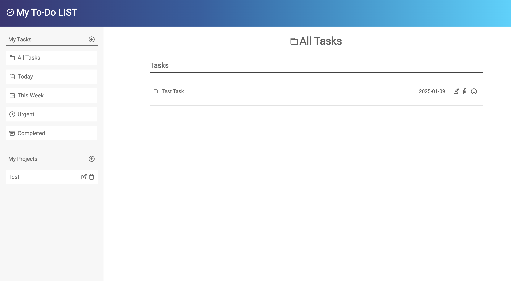

# To-Do-List

A feature-rich **Todo List** application built with JavaScript, designed to manage multiple projects and tasks with persistence via `localStorage`.


## Installation

Follow these steps to run the project locally:

1. **Clone the repository**
   ```bash
   git clone git@github.com:Maiker260/To-Do-List.git
   ```

2. **Install dependencies**
   ```bash
   cd To-Do-List
   npm install
   ```

3. **Build and run**
   ```bash
   npm run build
   npm start
   ```

4. **Open the app**  
    
## Features

- **Dynamic Todo Creation**
  - Todos are created using ES6 classes.
  - Each todo has:
    - **Title**
    - **Description**
    - **Due Date**
    - **Priority** (Low, Medium, Urgent)
    - **Status**

- **Projects / Lists**
  - Default project is available on first load.
  - Users can create new projects.
  - Users can assign todos to different projects.

- **Task Management**
  - View all projects.
  - View all todos for each project (title + due date).
  - Expand a single todo to view or edit details.
  - Mark todos as complete.
  - Delete todos.

- **Persistence**
  - Uses **Web Storage API (localStorage)** to save todos and projects.
  - Automatically loads saved data on app startup.
  - Handles cases where no saved data exists gracefully.

- **Modular Architecture**
  - Application logic (creating, editing, deleting todos) separated from DOM manipulation.
  - Organized modules for better maintainability.

- **Date Handling**
  - [date-fns](https://date-fns.org/) library used for date formatting and manipulation.


## Demo

https://maiker260.github.io/To-Do-List/


## Screenshots

Home Page



New Task


Task Info


## Acknowledgements

- [date-fns](https://date-fns.org/) – for date manipulation.
- [Webpack](https://webpack.js.org/) – for bundling modules.
- MDN Web Docs – for info on [Web Storage API](https://developer.mozilla.org/en-US/docs/Web/API/Web_Storage_API).


## Author

- [@Maiker260](https://github.com/Maiker260)